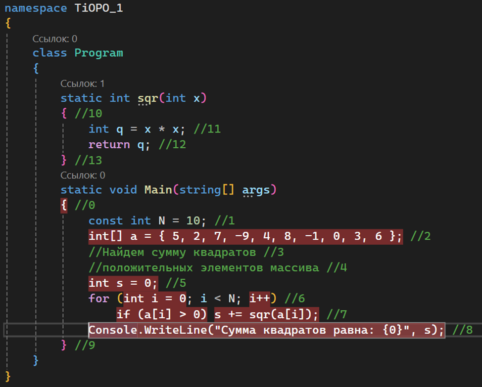

# Министерство науки и высшего образования Российской Федерации  
Федеральное государственное бюджетное образовательное учреждение  
высшего образования  
«КУБАНСКИЙ ГОСУДАРСТВЕННЫЙ ТЕХНОЛОГИЧЕСКИЙ УНИВЕРСИТЕТ»  
(ФГБОУ ВО «КубГТУ»)  

Институт компьютерных систем и информационной безопасности  
Кафедра информационных систем и программирования  

## ЛАБОРАТОРНАЯ РАБОТА №1  

**Дисциплина:** Тестирование и отладка программного обеспечение  
**Работу выполнил:** ___________________________________ Фролов А.А.  
**Направление подготовки:** 09.03.04 Программная инженерия  
**Преподаватель:** ______________________________________ Волик А.Г.  

Краснодар  
2025

---

**Название:** Отладка программ в интегрированных средах разработки.  

**Цель работы:** изучить инструментальные средства и возможности отладки программ в интегрированной среде Microsoft Visual Studio или JetBrains Rider.

**Задание:**  
1) Выполнить задание в соответствии с пунктом 5.1.  
2) Выполнить задание в соответствии с пунктом 5.2.  
3) Оформить отчёт.

---

## Ход работы:

### Задание №1

1) Набираю программу из примера 1.  
2) Выполняю программу по шагам:  

     

   Последовательность выполнения строк – 0, 2, 5, 6, 7, 7, 6, 7, 7, 6, 7, 7, 6, 7, 6, 7, 7, 6, 7, 7, 6, 7, 6, 7, 6, 7, 7, 6, 7, 7, 6, 8, 9.  

3) Набираю программу из примера 2 и повторяю:  

     

   Последовательность выполнения строк – 0, 2, 5, 6, 6, 7.0, 7.1, 6, 6, 7.0, 7.1, 6, 6, 7.0, 7.1, 6, 6, 7.0, 6, 6, 7.0, 7.1, 6, 6, 7.0, 7.1, 6, 6, 7.0, 6, 6, 7, 6, 6, 7.0, 7.1, 6, 6, 7.0, 7.1, 6, 6, 8, 9.  

4) Выполняю трассировку предыдущей программы:  

     

   Последовательность выполнения строк – 0, 2, 5, 6, 6, 7.0, 7.1, 10, 11, 12, 13, 7.1, 6, 6, 7.0, 7.1, 10, 11, 12, 13, 7.1, 6, 6, 7.0, 7.1, 10, 11, 12, 13, 7.1, 6, 6, 7.0, 6, 6, 7.0, 7.1, 10, 11, 12, 13, 6, 6, 7.0, 7.1, 10, 11, 12, 13, 6, 6, 7.0, 6, 6, 7.0, 6, 6, 7.0, 7.1, 10, 11, 12, 13, 6, 6, 7.0, 7.1, 10, 11, 12, 13, 6, 6, 8, 9.

### Задание №2

1) Набираю и компилирую программу, расставляя после каждой строки номера.  
2) Выполняю трассировку и отслеживаю переменные в левом нижнем углу при заходе в функцию `sum()`:  

     
     
     
     
   ![Рисунок 7 – установка точки останова на if (a[i] > z) и выполнение отладки с этой позиции](img/8.png)  
     
     
     
     
   

---

## Вывод:

В ходе выполнения лабораторной работы были изучены инструментальные средства и возможности отладки программ в интегрированной среде Microsoft Visual Studio или JetBrains Rider.
