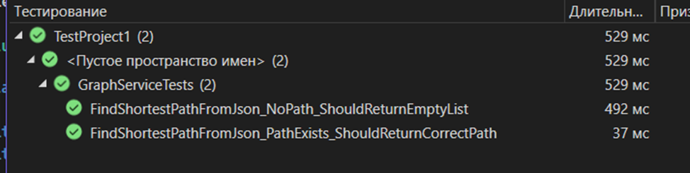

# Министерство науки и высшего образования Российской Федерации  
**Федеральное государственное бюджетное образовательное учреждение высшего образования**  
**«КУБАНСКИЙ ГОСУДАРСТВЕННЫЙ ТЕХНОЛОГИЧЕСКИЙ УНИВЕРСИТЕТ»**  
(ФГБОУ ВО «КубГТУ»)  

**Институт компьютерных систем и информационной безопасности**  
**Кафедра информационных систем и программирования**

---

## ЛАБОРАТОРНАЯ РАБОТА № 10

**Дисциплина:** Тестирование и отладка программного обеспечения  
**Работу выполнил:** А.А. Фролов  
**Направление подготовки:** 09.03.04 Программная инженерия  
**Преподаватель:** А. Г. Волик  


Краснодар  
2025

---

### Цель работы:
изучить подход к созданию тестов с помощью библиотеки Fluent Assertions.

### Задание:
1.  На основе класса из предыдущей лабораторной работы создать тестирующий проект, использующий библиотеку Fluent Assertions
2.  Протестировать проект.
3.  Оформить отчёт.

### Ход работы:
Модифицирую тесты из предыдущей работы, используя библиотеку Fluent Assertions.

#### Листинг Tests:
```csharp
using NUnit.Framework;
using NSubstitute;
using System;
using System.Collections.Generic;
using System.IO;
using FluentAssertions; // <-- 1. Подключаем Fluent Assertions

[TestFixture]
public class GraphServiceTests
{
    private GraphService _graphService;
    private IFileHandler _fileHandlerSubstitute;

    [SetUp]
    public void Setup()
    {
        _fileHandlerSubstitute = Substitute.For<IFileHandler>();
        _graphService = new GraphService(_fileHandlerSubstitute);
    }

    [Test]
    public void FindShortestPathFromJson_PathExists_ShouldReturnCorrectPath()
    {
        // Arrange (Подготовка)
        var stubMatrix = new int[,]
        {
            { 0, 1, 1, 0 },
            { 1, 0, 0, 1 },
            { 1, 0, 0, 1 },
            { 0, 1, 1, 0 }
        };
        string jsonInput = "any_json_string";

        _fileHandlerSubstitute.LoadFromJson(Arg.Any<TextReader>()).Returns(stubMatrix);

        // Act (Действие)
        var path = _graphService.FindShortestPathFromJson(jsonInput, 0, 3);

        // Assert (Проверка) с использованием Fluent Assertions
        // Вместо нескольких Assert'ов проверяем всю коллекцию целиком.
        // Это надежнее и читабельнее.
        var expectedPath = new List<int> { 0, 1, 3 };
        path.Should().BeEquivalentTo(expectedPath);

        // Проверка взаимодействия с моком остается без изменений, так как уже использует NSubstitute.
        _fileHandlerSubstitute.Received(1).LoadFromJson(Arg.Any<TextReader>());
    }

    [Test]
    public void FindShortestPathFromJson_NoPath_ShouldReturnEmptyList()
    {
        // Arrange
        var stubMatrix = new int[,]
        {
            { 0, 1, 0 },
            { 1, 0, 0 },
            { 0, 0, 0 }
        };
        _fileHandlerSubstitute.LoadFromJson(Arg.Any<TextReader>()).Returns(stubMatrix);

        // Act
        var path = _graphService.FindShortestPathFromJson("any_json", 0, 2);

        // Assert с использованием Fluent Assertions
        // Assert.IsEmpty(path) заменяется на path.Should().BeEmpty();
        path.Should().BeEmpty();

        _fileHandlerSubstitute.Received(1).LoadFromJson(Arg.Any<TextReader>());
    }
}
```


*Рисунок 1 – результат тестирования*

### Вывод:
в этой лабораторной работе я изучил упрощение создания тестов при помощи библиотеки Fluent Assertions.