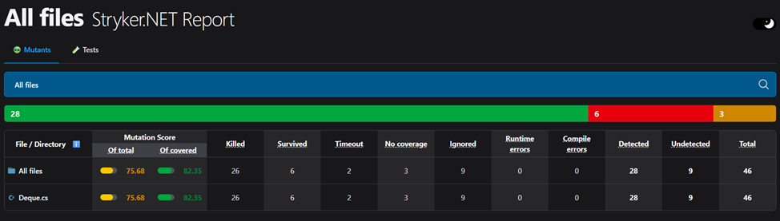
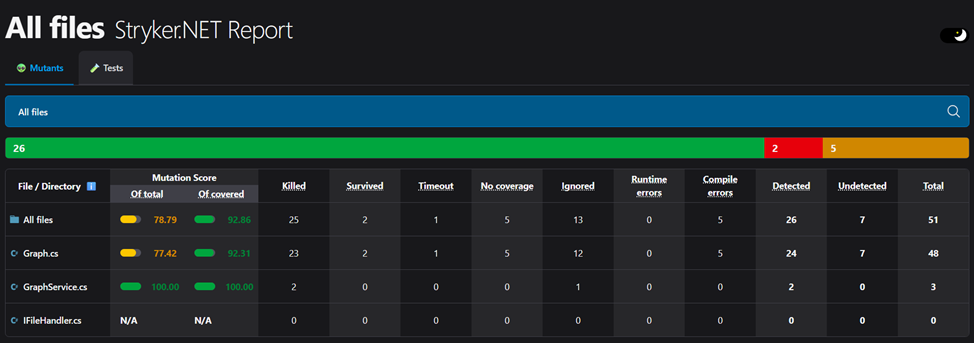

# Министерство науки и высшего образования Российской Федерации  
**Федеральное государственное бюджетное образовательное учреждение высшего образования**  
**«КУБАНСКИЙ ГОСУДАРСТВЕННЫЙ ТЕХНОЛОГИЧЕСКИЙ УНИВЕРСИТЕТ»**  
(ФГБОУ ВО «КубГТУ»)  

**Институт компьютерных систем и информационной безопасности**  
**Кафедра информационных систем и программирования**

---

## ЛАБОРАТОРНАЯ РАБОТА № 11

**Дисциплина:** Тестирование и отладка программного обеспечения  
**Работу выполнил:** А.А. Фролов  
**Направление подготовки:** 09.03.04 Программная инженерия  
**Преподаватель:** А. Г. Волик  


Краснодар  
2025

---

### Цель работы:
изучить принципы работы мутационного тестирования и использование библиотеки Stryker.NET для создания мутационных тестов.

### Задание:
1.  Проанализировать качество тестов в проектах из предыдущих лабораторных работ.
2.  Расширить тестовые наборы для обнаружения всех мутантов.
3.  Оформить отчёт.

### Ход работы:
Дополненные тесты к лабораторной №7:

#### Листинг – Тесты №7
```csharp
using NUnit.Framework;
using System;

[TestFixture]
public class DequeTests
{
    private Deque<int> _deque;

    [SetUp]
    public void Setup()
    {
        _deque = new Deque<int>();
    }

    // --- Тесты для состояния Empty (Требования TR-E1 ... TR-E6) ---
    [Test]
    public void PushFront_OnEmptyDeque_ShouldTransitionToOneItemState()
    {
        _deque.PushFront(10);
        Assert.AreEqual(1, _deque.Count, "Count should be 1");
        Assert.AreEqual(10, _deque.PeekFront(), "Front item should be 10");
        Assert.AreEqual(10, _deque.PeekBack(), "Back item should be 10");
    }

    [Test]
    public void PushBack_OnEmptyDeque_ShouldTransitionToOneItemState()
    {
        _deque.PushBack(20);
        Assert.AreEqual(1, _deque.Count, "Count should be 1");
        Assert.AreEqual(20, _deque.PeekFront(), "Front item should be 20");
        Assert.AreEqual(20, _deque.PeekBack(), "Back item should be 20");
    }

    [Test]
    public void PopFront_OnEmptyDeque_ShouldThrowException() =>
        Assert.Throws<InvalidOperationException>(() => _deque.PopFront());

    [Test]
    public void PopBack_OnEmptyDeque_ShouldThrowException() =>
        Assert.Throws<InvalidOperationException>(() => _deque.PopBack());

    [Test]
    public void PeekFront_OnEmptyDeque_ShouldThrowException() =>
        Assert.Throws<InvalidOperationException>(() => _deque.PeekFront());

    [Test]
    public void PeekBack_OnEmptyDeque_ShouldThrowException() =>
        Assert.Throws<InvalidOperationException>(() => _deque.PeekBack());

    // --- Тесты для состояния OneItem (Требования TR-O1 ... TR-O6) ---
    [Test]
    public void PushFront_OnOneItemDeque_ShouldTransitionToMultipleItemsState()
    {
        _deque.PushBack(10); // Устанавливаем состояние OneItem
        _deque.PushFront(20);

        Assert.AreEqual(2, _deque.Count, "Count should be 2");
        Assert.AreEqual(20, _deque.PeekFront(), "Front item should be 20");
        Assert.AreEqual(10, _deque.PeekBack(), "Back item should be 10");
    }

    [Test]
    public void PushBack_OnOneItemDeque_ShouldTransitionToMultipleItemsState()
    {
        _deque.PushFront(10); // Устанавливаем состояние OneItem
        _deque.PushBack(20);

        Assert.AreEqual(2, _deque.Count, "Count should be 2");
        Assert.AreEqual(10, _deque.PeekFront(), "Front item should be 10");
        Assert.AreEqual(20, _deque.PeekBack(), "Back item should be 20");
    }

    [Test]
    public void PopFront_OnOneItemDeque_ShouldTransitionToEmptyState()
    {
        _deque.PushBack(10); // Устанавливаем состояние OneItem
        int item = _deque.PopFront();

        Assert.AreEqual(10, item, "Returned item should be 10");
        Assert.AreEqual(0, _deque.Count, "Count should be 0");
        Assert.IsTrue(_deque.IsEmpty, "Deque should be empty");
    }

    [Test]
    public void PopBack_OnOneItemDeque_ShouldTransitionToEmptyState()
    {
        _deque.PushBack(10); // Устанавливаем состояние OneItem
        int item = _deque.PopBack();

        Assert.AreEqual(10, item, "Returned item should be 10");
        Assert.AreEqual(0, _deque.Count, "Count should be 0");
        Assert.IsTrue(_deque.IsEmpty, "Deque should be empty");
    }

    // --- Тесты для состояния MultipleItems (Требования TR-M1 ... TR-M6) ---
    [Test]
    public void PushFront_OnMultipleItemsDeque_ShouldAddToFront()
    {
        // Устанавливаем состояние MultipleItems
        _deque.PushBack(10);
        _deque.PushBack(20);

        _deque.PushFront(5);

        Assert.AreEqual(3, _deque.Count, "Count should be 3");
        Assert.AreEqual(5, _deque.PeekFront(), "Front item should be 5");
        Assert.AreEqual(20, _deque.PeekBack(), "Back item should be 20");
    }

    [Test]
    public void PushBack_OnMultipleItemsDeque_ShouldAddToBack()
    {
        // Устанавливаем состояние MultipleItems
        _deque.PushFront(10);
        _deque.PushFront(20);

        _deque.PushBack(25);

        Assert.AreEqual(3, _deque.Count, "Count should be 3");
        Assert.AreEqual(20, _deque.PeekFront(), "Front item should be 20");
        Assert.AreEqual(25, _deque.PeekBack(), "Back item should be 25");
    }

    [Test]
    public void PopFront_OnMultipleItemsDeque_ShouldReturnCorrectItem()
    {
        // Устанавливаем состояние MultipleItems
        _deque.PushBack(10);
        _deque.PushBack(20);
        _deque.PushBack(30);

        int item = _deque.PopFront();

        Assert.AreEqual(10, item, "Returned item should be 10");
        Assert.AreEqual(2, _deque.Count, "Count should be 2");
        Assert.AreEqual(20, _deque.PeekFront(), "New front item should be 20");
    }

    [Test]
    public void PopBack_OnMultipleItemsDeque_ShouldReturnCorrectItem()
    {
        // Устанавливаем состояние MultipleItems
        _deque.PushBack(10);
        _deque.PushBack(20);
        _deque.PushBack(30);

        int item = _deque.PopBack();

        Assert.AreEqual(30, item, "Returned item should be 30");
        Assert.AreEqual(2, _deque.Count, "Count should be 2");
        Assert.AreEqual(20, _deque.PeekBack(), "New back item should be 20");
    }
}
```


*Рисунок 1 – Результаты тестов к лабораторной №7*

Дополненные тесты к лабораторной №11:

#### Листинг – Тесты №11
```csharp
using NUnit.Framework;
using NSubstitute;
using System;
using System.Collections.Generic;
using System.IO;
using FluentAssertions;

[TestFixture]
public class GraphServiceTests
{
    private GraphService _graphService;
    private IFileHandler _fileHandlerSubstitute;

    [SetUp]
    public void Setup()
    {
        _fileHandlerSubstitute = Substitute.For<IFileHandler>();
        _graphService = new GraphService(_fileHandlerSubstitute);
    }

    [Test]
    public void FindShortestPathFromJson_PathExists_ShouldReturnCorrectPath()
    {
        // Arrange (Подготовка)
        var stubMatrix = new int[,]
        {
            { 0, 1, 1, 0 },
            { 1, 0, 0, 1 },
            { 1, 0, 0, 1 },
            { 0, 1, 1, 0 }
        };
        string jsonInput = "any_json_string";

        _fileHandlerSubstitute.LoadFromJson(Arg.Any<TextReader>()).Returns(stubMatrix);

        // Act (Действие)
        var path = _graphService.FindShortestPathFromJson(jsonInput, 0, 3);

        // Assert (Проверка) с использованием Fluent Assertions
        // Вместо нескольких Assert'ов проверяем всю коллекцию целиком.
        // Это надежнее и читабельнее.
        var expectedPath = new List<int> { 0, 1, 3 };
        path.Should().BeEquivalentTo(expectedPath);

        // Проверка взаимодействия с моком остается без изменений, так как уже использует NSubstitute.
        _fileHandlerSubstitute.Received(1).LoadFromJson(Arg.Any<TextReader>());
    }

    [Test]
    public void FindShortestPathFromJson_NoPath_ShouldReturnEmptyList()
    {
        // Arrange
        var stubMatrix = new int[,]
        {
            { 0, 1, 0 },
            { 1, 0, 0 },
            { 0, 0, 0 }
        };
        _fileHandlerSubstitute.LoadFromJson(Arg.Any<TextReader>()).Returns(stubMatrix);

        // Act
        var path = _graphService.FindShortestPathFromJson("any_json", 0, 2);

        // Assert с использованием Fluent Assertions
        // Assert.IsEmpty(path) заменяется на path.Should().BeEmpty();
        path.Should().BeEmpty();

        _fileHandlerSubstitute.Received(1).LoadFromJson(Arg.Any<TextReader>());
    }
}
```


*Рисунок 2 – результат тестов к лабораторной №11*

### Вывод:
в ходе выполнения лабораторной работы был изучен подход к тестированию методом серого ящика.