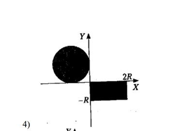
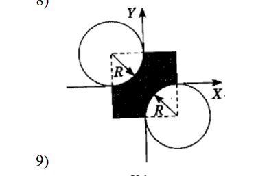
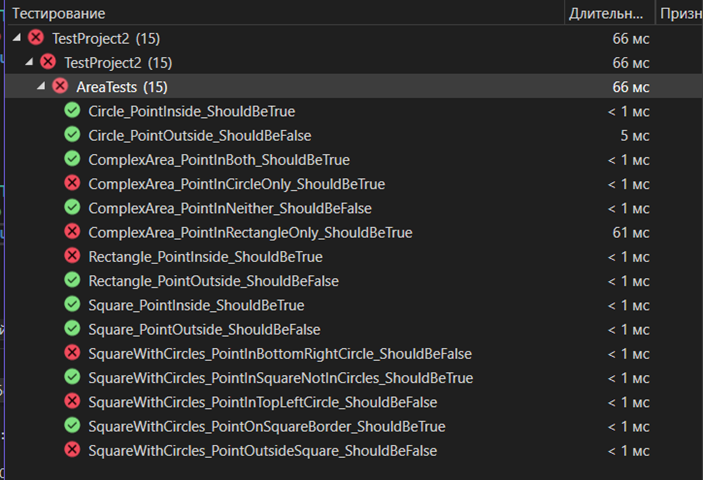

# Министерство науки и высшего образования Российской Федерации  
**Федеральное государственное бюджетное образовательное учреждение высшего образования**  
**«КУБАНСКИЙ ГОСУДАРСТВЕННЫЙ ТЕХНОЛОГИЧЕСКИЙ УНИВЕРСИТЕТ»**  
(ФГБОУ ВО «КубГТУ»)  

**Институт компьютерных систем и информационной безопасности**  
**Кафедра информационных систем и программирования**

---

## ЛАБОРАТОРНАЯ РАБОТА № 12

**Дисциплина:** Тестирование и отладка программного обеспечения  
**Работу выполнил:** А.А. Фролов  
**Направление подготовки:** 09.03.04 Программная инженерия  
**Преподаватель:** А. Г. Волик  


Краснодар  
2025

---

### Цель работы:
закрепить принципы тестирования методом черного ящика и использования внешних библиотек.

### Задание:
1.  Подключить внешнюю библиотеку к новому проекту.
2.  В код части классов библиотеки целенаправленно были внесены одна или несколько ошибок. Часть классов работает корректно.
3.  Создать проект с модульными тестами для подключенной библиотеки и написать тесты для класса `Area` реализующей проверку попадания в закрашенную область фигуры в соответствии с вариантом задания из пункта 5. Необходимо обнаружить ошибки в коде (если они есть) и указать при каких условиях они возникают.
4.  Оформить отчёт.

### Фигуры:




### Решение:

#### Код библиотеки:
```csharp
// Первая фигура: комбинированная область из круга и прямоугольника
public class ComplexArea : IArea
{
    private readonly Circle _circle;
    private readonly Rectangle _rectangle;

    public ComplexArea(double circleRadius, double circleCenterX, double circleCenterY,
    double rectX1, double rectY1, double rectX2, double rectY2)
    {
        _circle = new Circle(circleRadius, circleCenterX, circleCenterY);
        _rectangle = new Rectangle(rectX1, rectY1, rectX2, rectY2);
    }

    public bool IsPointInArea(double x, double y)
    {
        // Ошибка: должно быть ИЛИ, а не И
        return _circle.IsPointInArea(x, y) && _rectangle.IsPointInArea(x, y);
    }
}

// Вторая фигура: квадрат с вырезанными окружностями в углах
public class SquareWithCircles : IArea
{
    private readonly Square _square;
    private readonly Circle _topLeftCircle;
    private readonly Circle _bottomRightCircle;

    public SquareWithCircles(double squareSide, double squareCenterX, double squareCenterY)
    {
        double halfSide = squareSide / 2;

        // Квадрат
        _square = new Square(squareCenterX - halfSide, squareCenterY + halfSide,
        squareCenterX + halfSide, squareCenterY - halfSide);

        // Ошибка: радиус должен быть halfSide, но установлен неправильно
        double circleRadius = squareSide; // Должно быть halfSide

        // Центры окружностей в углах квадрата
        _topLeftCircle = new Circle(circleRadius, squareCenterX - halfSide, squareCenterY + halfSide);
        _bottomRightCircle = new Circle(circleRadius, squareCenterX + halfSide, squareCenterY - halfSide);
    }

    public bool IsPointInArea(double x, double y)
    {
        // Ошибка: неправильная логика - должно быть в квадрате И НЕ в окружностях
        return _square.IsPointInArea(x, y) ||
        !_topLeftCircle.IsPointInArea(x, y) &&
        !_bottomRightCircle.IsPointInArea(x, y);
    }
}

// Вспомогательные классы
public class Circle : IArea
{
    private readonly double _radius;
    private readonly double _centerX;
    private readonly double _centerY;

    public Circle(double radius, double centerX, double centerY)
    {
        _radius = radius;
        _centerX = centerX;
        _centerY = centerY;
    }

    public bool IsPointInArea(double x, double y)
    {
        double distanceSquared = Math.Pow(x - _centerX, 2) + Math.Pow(y - _centerY, 2);
        return distanceSquared <= Math.Pow(_radius, 2);
    }
}

public class Rectangle : IArea
{
    private readonly double _x1, _y1, _x2, _y2;

    public Rectangle(double x1, double y1, double x2, double y2)
    {
        _x1 = Math.Min(x1, x2);
        _y1 = Math.Max(y1, y2); // Ошибка: должно быть Math.Min/Max для правильного определения границ
        _x2 = Math.Max(x1, x2);
        _y2 = Math.Min(y1, y2);
    }

    public bool IsPointInArea(double x, double y)
    {
        // Ошибка: неправильные границы из-за ошибки в конструкторе
        return x >= _x1 && x <= _x2 && y >= _y1 && y <= _y2;
    }
}

public class Square : IArea
{
    private readonly double _left, _top, _right, _bottom;

    public Square(double left, double top, double right, double bottom)
    {
        _left = left;
        _top = top;
        _right = right;
        _bottom = bottom;
    }

    public bool IsPointInArea(double x, double y)
    {
        return x >= _left && x <= _right && y >= _bottom && y <= _top;
    }
}
```

#### Код тестов черного ящика:
```csharp
[TestClass]
public class AreaTests
{
    // Тесты для ComplexArea
    [TestMethod]
    public void ComplexArea_PointInCircleOnly_ShouldBeTrue()
    {
        // Точка только в круге (-3, 3)
        var area = new ComplexArea(5, -5, 0, 0, -5, 5, 0);
        Assert.IsTrue(area.IsPointInArea(-3, 3));
    }

    [TestMethod]
    public void ComplexArea_PointInRectangleOnly_ShouldBeTrue()
    {
        // Точка только в прямоугольнике (3, -3)
        var area = new ComplexArea(5, -5, 0, 0, -5, 5, 0);
        Assert.IsTrue(area.IsPointInArea(3, -3));
    }

    [TestMethod]
    public void ComplexArea_PointInBoth_ShouldBeTrue()
    {
        // Точка в обеих областях - такой нет, так как области не пересекаются
        var area = new ComplexArea(5, -5, 0, 0, -5, 5, 0);
        Assert.IsFalse(area.IsPointInArea(0, 0)); // Граничная точка
    }

    [TestMethod]
    public void ComplexArea_PointInNeither_ShouldBeFalse()
    {
        // Точка ни в одной области (-10, -10)
        var area = new ComplexArea(5, -5, 0, 0, -5, 5, 0);
        Assert.IsFalse(area.IsPointInArea(-10, -10));
    }

    // Тесты для SquareWithCircles
    [TestMethod]
    public void SquareWithCircles_PointInSquareNotInCircles_ShouldBeTrue()
    {
        // Точка в центре квадрата (0, 0) - не в окружностях
        var area = new SquareWithCircles(10, 0, 0);
        Assert.IsTrue(area.IsPointInArea(0, 0));
    }

    [TestMethod]
    public void SquareWithCircles_PointInTopLeftCircle_ShouldBeFalse()
    {
        // Точка в левой верхней окружности (-4, 4)
        var area = new SquareWithCircles(10, 0, 0);
        Assert.IsFalse(area.IsPointInArea(-4, 4));
    }

    [TestMethod]
    public void SquareWithCircles_PointInBottomRightCircle_ShouldBeFalse()
    {
        // Точка в правой нижней окружности (4, -4)
        var area = new SquareWithCircles(10, 0, 0);
        Assert.IsFalse(area.IsPointInArea(4, -4));
    }

    [TestMethod]
    public void SquareWithCircles_PointOutsideSquare_ShouldBeFalse()
    {
        // Точка вне квадрата (6, 6)
        var area = new SquareWithCircles(10, 0, 0);
        Assert.IsFalse(area.IsPointInArea(6, 6));
    }

    [TestMethod]
    public void SquareWithCircles_PointOnSquareBorder_ShouldBeTrue()
    {
        // Точка на границе квадрата, но не в окружностях (0, 5)
        var area = new SquareWithCircles(10, 0, 0);
        Assert.IsTrue(area.IsPointInArea(0, 5));
    }

    // Тесты для отдельных фигур
    [TestMethod]
    public void Circle_PointInside_ShouldBeTrue()
    {
        var circle = new Circle(5, 0, 0);
        Assert.IsTrue(circle.IsPointInArea(3, 3));
    }

    [TestMethod]
    public void Circle_PointOutside_ShouldBeFalse()
    {
        var circle = new Circle(5, 0, 0);
        Assert.IsFalse(circle.IsPointInArea(6, 6));
    }

    [TestMethod]
    public void Rectangle_PointInside_ShouldBeTrue()
    {
        var rect = new Rectangle(0, 5, 5, 0);
        Assert.IsTrue(rect.IsPointInArea(3, 3));
    }

    [TestMethod]
    public void Rectangle_PointOutside_ShouldBeFalse()
    {
        var rect = new Rectangle(0, 5, 5, 0);
        Assert.IsFalse(rect.IsPointInArea(6, 3));
    }

    [TestMethod]
    public void Square_PointInside_ShouldBeTrue()
    {
        var square = new Square(-5, 5, 5, -5);
        Assert.IsTrue(square.IsPointInArea(0, 0));
    }

    [TestMethod]
    public void Square_PointOutside_ShouldBeFalse()
    {
        var square = new Square(-5, 5, 5, -5);
        Assert.IsFalse(square.IsPointInArea(6, 6));
    }
}
```

### Обнаруженные ошибки:
-   **ComplexArea** – ошибка когда любая точка принадлежит только одной из фигур (`ComplexArea_PointInCircleOnly_ShouldBeTrue` и `ComplexArea_PointInRectangleOnly_ShouldBeTrue`)
-   **SquareWithCircles** – ошибка когда точка находится внутри квадрата и не в окружностях (`SquareWithCircles_PointInSquareNotInCircles_ShouldBeTrue`)
-   **SquareWithCircles** – ошибка когда точка находится в одной из окружностей (`SquareWithCircles_PointInTopLeftCircle_ShouldBeFalse` и `SquareWithCircles_PointInBottomRightCircle_ShouldBeFalse`)
-   **Rectangle** – ошибка когда точка находится внутри прямоугольника, заданного координатами (0,5,5,0) (`Rectangle_PointInside_ShouldBeTrue`)

### Результаты тестирования:



Краснодар
2025