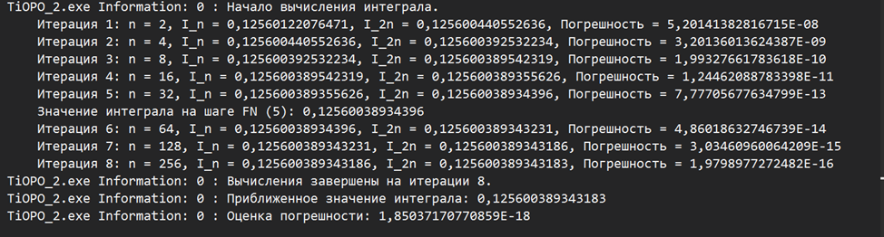
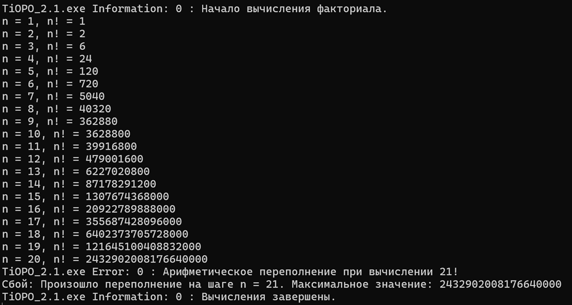

# Министерство науки и высшего образования Российской Федерации  
**Федеральное государственное бюджетное образовательное учреждение высшего образования**  
**«КУБАНСКИЙ ГОСУДАРСТВЕННЫЙ ТЕХНОЛОГИЧЕСКИЙ УНИВЕРСИТЕТ»**  
(ФГБОУ ВО «КубГТУ»)  

**Институт компьютерных систем и информационной безопасности**  
**Кафедра информационных систем и программирования**

---

## ЛАБОРАТОРНАЯ РАБОТА № 2  

**Дисциплина:** Тестирование и отладка программного обеспечения  

**Работу выполнил:** _________________________ А.А. Фролов  

**Направление подготовки:** 09.03.04 Программная инженерия  

**Преподаватель:** _________________________ А.Г. Волик  

Краснодар  
2025

---

**Название:** Программная отладка и трассировка программ  

**Цель работы:** Изучить средства и возможности программной отладки и трассировки программ.

---

## Задание

### 4.1) Листинг класса для приближённого интегрирования по методу Симпсона:

```csharp
using System;
using System.Collections.Generic;
using System.Diagnostics;
using System.Linq;
using System.Text;
using System.Threading.Tasks;

namespace TiOPO_2
{
    internal class Program
    {
        // Подынтегральная функция (Вариант 2)
        static double f(double x)
        {
            return (Math.Pow(x, 2) + Math.Sin(0.48 * (x + 2))) / Math.Exp(Math.Pow(x, 2) + 0.38);
        }

        // Метод Симпсона
        static double SimpsonIntegration(double a, double b, int n)
        {
            // Убедимся, что n четное для метода Симпсона
            if (n % 2 != 0) n++;
            double h = (b - a) / n;
            double sum = f(a) + f(b);
            for (int i = 1; i < n; i++)
            {
                double x = a + i * h;
                // Проверка границ при помощи Assert
                Debug.Assert(x >= a && x <= b, $"Переменная x ({x}) вышла за границы интегрирования [{a}, {b}]");
                sum += (i % 2 == 0) ? 2 * f(x) : 4 * f(x);
            }
            return sum * h / 3;
        }

        // Правило Рунге для оценки погрешности (p = 4 для Симпсона)
        static double RungeError(double I_n, double I_2n, int p = 4)
        {
            return Math.Abs(I_2n - I_n) / (Math.Pow(2, p) - 1);
        }

        static void Main(string[] args)
        {
            // Данные по варианту
            double a = 0.4;
            double b = 0.6;
            double epsilon = 0.000000000000000000000000000000000000000000000000000000001;
            int FN_step = 5;
            int LN_step = 17;

            // Добавляем прослушиватель для вывода трассировки в консоль
            Trace.Listeners.Add(new ConsoleTraceListener());
            Trace.AutoFlush = true;

            int n = 2; // Начальное количество отрезков
            double I_n = SimpsonIntegration(a, b, n);
            double I_2n = SimpsonIntegration(a, b, 2 * n);
            double error = RungeError(I_n, I_2n);
            int iteration = 1;

            // Трассировка: начало
            Trace.TraceInformation("Начало вычисления интеграла.");
            Trace.Indent();

            // Итерационный процесс с контролем точности по Рунге
            while (error > epsilon)
            {
                // Трассировка значений на каждой итерации
                Trace.WriteLine($"Итерация {iteration}: n = {n}, I_n = {I_n}, I_2n = {I_2n}, Погрешность = {error}");

                // Задание: вывод на конкретных шагах
                if (iteration == FN_step)
                {
                    Debug.WriteLine($"Значение интеграла на шаге FN ({FN_step}): {I_2n}");
                }
                if (iteration == LN_step)
                {
                    Trace.WriteLine($"Значение интеграла на шаге LN ({LN_step}): {I_2n}");
                }

                n *= 2;
                I_n = I_2n;
                I_2n = SimpsonIntegration(a, b, 2 * n);
                error = RungeError(I_n, I_2n);
                iteration++;
            }

            // Трассировка: завершение
            Trace.Unindent();
            Trace.TraceInformation($"Вычисления завершены на итерации {iteration - 1}.");
            Trace.TraceInformation($"Приближенное значение интеграла: {I_2n}");
            Trace.TraceInformation($"Оценка погрешности: {error}");

            // Финализация
            Console.WriteLine($"Результат: {I_2n}");
            Console.ReadKey();
        }
    }
}
```

Рисунок 1 – процесс трассировки  


---

### 4.2) Листинг класса для вычисления арифметической прогрессии:

> **Примечание:** в коде реализуется вычисление факториала, а не арифметической прогрессии.

```csharp
using System;
using System.Collections.Generic;
using System.Diagnostics;
using System.Linq;
using System.Text;
using System.Threading.Tasks;

namespace TiOPO_2._1
{
    internal class Program
    {
        static void Main(string[] args)
        {
            // Добавляем прослушиватель для вывода трассировки в консоль
            Trace.Listeners.Add(new ConsoleTraceListener());
            Trace.AutoFlush = true;

            Trace.TraceInformation("Начало вычисления факториала.");

            int n = 1;
            long factorial = 1; // Используем long, чтобы отсрочить переполнение

            // Бесконечный цикл для демонстрации переполнения
            while (true)
            {
                try
                {
                    // Проверяем переполнение с помощью checked
                    long previousFactorial = factorial;
                    factorial = checked(factorial * n);

                    // Вывод текущего значения в трассировку
                    Trace.WriteLine($"n = {n}, n! = {factorial}");
                    n++;
                }
                catch (OverflowException)
                {
                    // При переполнении выводим ошибку в лог трассировки и выходим из цикла
                    Trace.TraceError($"Арифметическое переполнение при вычислении {n}!");

                    // Используем Assert для индикации ошибки в отладке
                    Debug.Fail($"Произошло переполнение на шаге n = {n}. Максимальное значение: {factorial}");
                    break;
                }
            }

            Trace.TraceInformation("Вычисления завершены.");
            Console.ReadKey();
        }
    }
}
```

Рисунок 2 – результат работы программы  


---

## Вывод

В ходе выполнения лабораторной работы были изучены средства и возможности программной отладки и трассировки программ.

