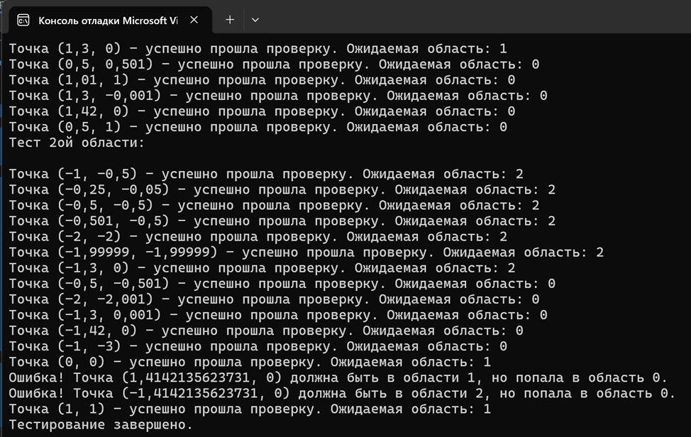

# Министерство науки и высшего образования Российской Федерации  
**Федеральное государственное бюджетное образовательное учреждение высшего образования**  
**«КУБАНСКИЙ ГОСУДАРСТВЕННЫЙ ТЕХНОЛОГИЧЕСКИЙ УНИВЕРСИТЕТ»**  
(ФГБОУ ВО «КубГТУ»)  

**Институт компьютерных систем и информационной безопасности**  
**Кафедра информационных систем и программирования**

---

## ЛАБОРАТОРНАЯ РАБОТА № 3

**Дисциплина:** Тестирование и отладка программного обеспечения  
**Работу выполнил:** А.А. Фролов  
**Направление подготовки:** 09.03.04 Программная инженерия  
**Преподаватель:** А. Г. Волик  


Краснодар  
2025

---

**Название:** Тестирование методом черного ящика  

**Цель работы:** изучить подход к тестированию методом черного ящика.

---

## Задание

Создать класс, реализующий проверку принадлежности точки различным областям плоскости, задаваемых пересечением фигур.  
Значения, характеризующие фигуры (R, a, b и т.д.), задать как свойства классов.  
В составе класса создать метод `TestPoint`, определяющий, в какой из областей, задаваемых представленными ниже фигурами, находится точка с заданными координатами.  

На вход передаются координаты точки. Результатом работы метода должен быть номер области. Нумерация областей производится по усмотрению разработчика, однако должно сохраняться их соответствие между запусками программы. При разбиении на области не учитывать разделение координатными осями.

---

## Ход работы

Определены классы эквивалентности:

1. Область 1, ограниченная функциями \( y = x \) и \( y = -x^2 + 2 \) сверху и лежащая выше оси \( X \).  
2. Область 2, ограниченная осью \( X \) и функцией \( y = -x^2 + 2 \) сверху и функцией \( y = x \) снизу.  
3. Область 0: вне первых 2-х областей.

---

## Листинг программы

```csharp
internal class Program
{
    public static void Main()
    {
        PointChecker checker = new PointChecker();

        // Тесты для первой области (классы эквивалентности)
        Console.WriteLine("Тест 1ой области:\n");
        TestPoint(checker, 1, 0.5, 1);            // Внутри первой области
        TestPoint(checker, 0.25, 0.05, 1);        // Внутри первой области
        TestPoint(checker, 0.5, 0.5, 1);          // На границе y = x
        TestPoint(checker, 0.501, 0.5, 1);        // Чуть правее границы y = x
        TestPoint(checker, 1, 1, 1);              // Точка пересечения
        TestPoint(checker, 1, 0.99, 1);           // Чуть ниже точки пересечения
        TestPoint(checker, 1.3, 0, 1);            // На границе по оси X
        TestPoint(checker, 0.5, 0.501, 0);        // Выше границы y = x
        TestPoint(checker, 1.01, 1, 0);           // Выше точки пересечения
        TestPoint(checker, 1.3, -0.001, 0);       // Ниже границы по оси X
        TestPoint(checker, 1.42, 0, 0);           // Правее параболы
        TestPoint(checker, 0.5, 1, 0);            // Вне области

        Console.WriteLine("Тест 2ой области:\n");
        TestPoint(checker, -1, -0.5, 2);          // Внутри второй области
        TestPoint(checker, -0.25, -0.05, 2);      // Внутри второй области
        TestPoint(checker, -0.5, -0.5, 2);        // На границе y = x
        TestPoint(checker, -0.501, -0.5, 2);      // Чуть левее границы y = x
        TestPoint(checker, -2, -2, 2);            // Точка пересечения
        TestPoint(checker, -1.99999, -1.99999, 2); // Чуть выше точки пересечения
        TestPoint(checker, -1.3, 0, 2);           // На границе по оси X
        TestPoint(checker, -0.5, -0.501, 0);      // Ниже границы y = x
        TestPoint(checker, -2, -2.001, 0);        // Ниже точки пересечения
        TestPoint(checker, -1.3, 0.001, 0);       // Выше границы по оси X
        TestPoint(checker, -1.42, 0, 0);          // Левее параболы
        TestPoint(checker, -1, -3, 0);            // Вне области

        TestPoint(checker, Math.Sqrt(2), 0, 1);   // Пересечение параболы с осью X (правая часть)
        TestPoint(checker, -Math.Sqrt(2), 0, 2);  // Пересечение параболы с осью X (левая часть)
        TestPoint(checker, 1, 1, 1);              // На линии y = x внутри параболы

        Console.WriteLine("Тестирование завершено.");
    }

    private static void TestPoint(PointChecker checker, double x, double y, int expectedRegion)
    {
        int actualRegion = checker.TestPoint(x, y);
        if (actualRegion == expectedRegion)
        {
            Console.WriteLine($"Точка ({x}, {y}) - успешно прошла проверку. Ожидаемая область: {expectedRegion}");
        }
        else
        {
            Console.WriteLine($"Ошибка! Точка ({x}, {y}) должна быть в области {expectedRegion}, но попала в область {actualRegion}.");
        }
    }
}

public class PointChecker
{
    public int TestPoint(double x, double y)
    {
        double Y = -(x * x) + 2;

        // Проверка, попадает ли точка в первую область
        if (y >= 0 && y <= x && y <= Y)
            return 1; // Первая область

        // Проверка, попадает ли точка во вторую область
        if (y <= 0 && y >= x && y <= Y)
            return 2; // Вторая область

        return 0; // Вне областей
    }
}
```



---

## Вывод

В ходе выполнения лабораторной работы были изучены способы тестирования методом чёрного ящика.
