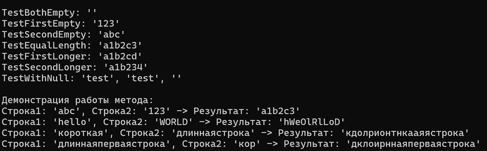

# Министерство науки и высшего образования Российской Федерации  
Федеральное государственное бюджетное образовательное учреждение  
высшего образования  
«КУБАНСКИЙ ГОСУДАРСТВЕННЫЙ ТЕХНОЛОГИЧЕСКИЙ УНИВЕРСИТЕТ»  
(ФГБОУ ВО «КубГТУ»)  

**Институт компьютерных систем и информационной безопасности**  
**Кафедра информационных систем и программирования**

## ЛАБОРАТОРНАЯ РАБОТА № 4

**Дисциплина:** Тестирование и отладка программного обеспечения  
**Работу выполнил:** А. А. Фролов  
**Направление подготовки:** 09.03.04 Программная инженерия  
**Преподаватель:** А. Г. Волик  


Краснодар  
2025

---

**Название:** Тестирование методом белого ящика  

**Цель работы:** изучить подход к тестированию методом белого ящика.

---

## Задание:

1. Создать класс (в соответствии с вариантом задания из п.5), реализующий обработку текстовой информации.  
2. Построить управляющий граф программы (УГП).  
3. Используя знания о структуре программы, определить набор тестов для тестирования методом белого ящика.  
4. Указать, какие пути реализуются (проверяются) тестом.  
5. Указать, какие критерии покрываются путем (см. таблица 4.2).  
6. Оценить качество полученных тестовых данных с точки зрения покрытия кода тестами.  
7. Протестировать метод с использованием средств автоматизации тестирования.  
8. Составить отчет о результатах проведенного тестирования.

**Вариант 3:** Создать класс, метод для слияния строк (посимвольное).

---

## Ход работы:

Создан класс, реализующий метод для слияния строк (посимвольное).

### Листинг 1 – Класс `MergeStrings`

```csharp
public string MergeStrings(string str1, string str2)
{
    // Блок 1: Инициализация
    StringBuilder result = new StringBuilder();
    int i = 0;
    int length1 = str1?.Length ?? 0;
    int length2 = str2?.Length ?? 0;

    // Блок 2: Основной цикл слияния
    while (i < length1 && i < length2) // Условие 1
    {
        // Блок 3: Добавление символов из обеих строк
        if (str1 != null && i < str1.Length)
            result.Append(str1[i]);
        if (str2 != null && i < str2.Length)
            result.Append(str2[i]);
        i++; // Блок 4: Инкремент счетчика
    }

    // Блок 5: Добавление остатка первой строки
    while (i < length1) // Условие 2
    {
        if (str1 != null && i < str1.Length)
            result.Append(str1[i]);
        i++;
    }

    // Блок 6: Добавление остатка второй строки
    while (i < length2) // Условие 3
    {
        if (str2 != null && i < str2.Length)
            result.Append(str2[i]);
        i++;
    }

    // Блок 7: Возврат результата
    return result.ToString();
}
```



### Управляющий граф программы


---

## Набор тестов:

1. Обе строки `null`  
2. Первая строка `null`, вторая не `null`  
3. Вторая строка `null`, первая не `null`  
4. Обе строки не `null` и одинаковой длины  
5. Первая строка длиннее второй  
6. Вторая строка длиннее первой  
7. Первая строка пустая, вторая не `null`  
8. Вторая строка пустая, первая не `null`

### Листинг тестов:

```csharp
public class StringMergerTests
{
    private readonly StringMerger _merger = new StringMerger();

    public void TestBothEmpty()
    {
        string result = _merger.MergeStrings("", "");
        Console.WriteLine($"TestBothEmpty: '{result}'");
    }

    public void TestFirstEmpty()
    {
        string result = _merger.MergeStrings("", "123");
        Console.WriteLine($"TestFirstEmpty: '{result}'");
    }

    public void TestSecondEmpty()
    {
        string result = _merger.MergeStrings("abc", "");
        Console.WriteLine($"TestSecondEmpty: '{result}'");
    }

    public void TestEqualLength()
    {
        string result = _merger.MergeStrings("abc", "123");
        Console.WriteLine($"TestEqualLength: '{result}'");
    }

    public void TestFirstLonger()
    {
        string result = _merger.MergeStrings("abcd", "12");
        Console.WriteLine($"TestFirstLonger: '{result}'");
    }

    public void TestSecondLonger()
    {
        string result = _merger.MergeStrings("ab", "1234");
        Console.WriteLine($"TestSecondLonger: '{result}'");
    }

    public void TestWithNull()
    {
        string result1 = _merger.MergeStrings(null, "test");
        string result2 = _merger.MergeStrings("test", null);
        string result3 = _merger.MergeStrings(null, null);
        Console.WriteLine($"TestWithNull: '{result1}', '{result2}', '{result3}'");
    }
}
```

---

## Таблица путей в УГП:

| № | Путь                   | Входные данные      | Ожидаемый результат | Реализуемые пути                             |
|---|------------------------|---------------------|----------------------|----------------------------------------------|
| 1 | 1 → 2 → 5 → 6 → 7      | `""`, `""`          | `""`                 | Все операторы, решения (`false`)             |
| 2 | 1 → 2 → 5 → 6 → 6.1 → 6 → 7 | `""`, `"123"`   | `"123"`              | Условие 3 (`true`)                           |
| 3 | 1 → 2 → 5 → 5.1 → 5 → 6 → 7 | `"abc"`, `""`   | `"abc"`              | Условие 2 (`true`)                           |
| 4 | 1 → 2 → 3 → 4 → 2 → 5 → 6 → 7 | `"abc"`, `"123"` | `"a1b2c3"`         | Условие 1 (`true` / `false`)                 |
| 5 | 1 → 2 → 3 → 4 → 2 → 5 → 5.1 → 5 → 6 → 7 | `"abcd"`, `"12"` | `"a1b2cd"` | Условия (`i < l1 = true`, `i < l2 = false`) |
| 6 | 1 → 2 → 3 → 4 → 2 → 5 → 6 → 6.1 → 6 → 7 | `"ab"`, `"1234"` | `"a1b234"` | Условия (`i < l1 = false`, `i < l2 = true`) |

---

## Таблица соответствия критериев покрытия выбранным путям:

| Критерий                        | Покрытые тесты         | Степень покрытия                             |
|----------------------------------|------------------------|----------------------------------------------|
| Покрытие операторов             | Все тесты (1–6)        | 100% — все операторы выполняются             |
| Покрытие решений                | Все тесты (1–6)        | 100% — все условия принимают `true` и `false`|
| Покрытие условий                | Тесты 4, 5, 6          | 100% — все элементарные условия проверены    |
| Покрытие путей                  | Все тесты (1–6)        | 100% — все основные пути покрыты             |
| Комбинаторное покрытие условий  | Тесты 4, 5, 6, 7       | 100% — все комбинации условий в основном цикле|

---

## Вывод:

В ходе выполнения лабораторной работы был изучен подход к тестированию методом белого ящика.
