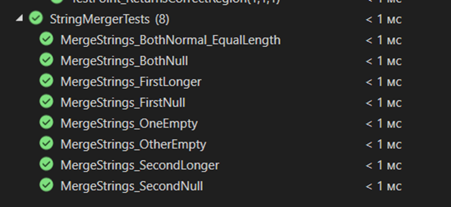
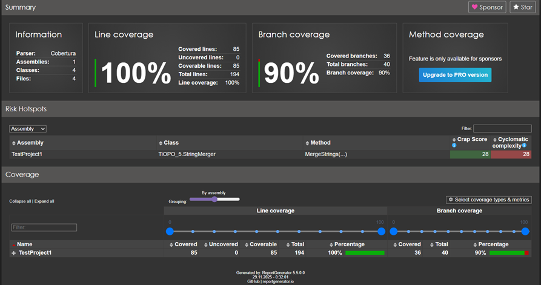

# Министерство науки и высшего образования Российской Федерации  
**Федеральное государственное бюджетное образовательное учреждение высшего образования**  
**«КУБАНСКИЙ ГОСУДАРСТВЕННЫЙ ТЕХНОЛОГИЧЕСКИЙ УНИВЕРСИТЕТ»**  
(ФГБОУ ВО «КубГТУ»)  

**Институт компьютерных систем и информационной безопасности**  
**Кафедра информационных систем и программирования**

---

## ЛАБОРАТОРНАЯ РАБОТА № 5

**Дисциплина:** Тестирование и отладка программного обеспечения  
**Работу выполнил:** А.А. Фролов  
**Направление подготовки:** 09.03.04 Программная инженерия  
**Преподаватель:** А. Г. Волик  


Краснодар  
2025

---

**Тема:** Тестирование, управляемое данными (Data-Driven Unit Tests) и Анализ покрытия кода (Code Coverage)

**Цель работы:** Изучить подход к автоматизации процесса тестирования с помощью средств среды разработки Microsoft Visual Studio, а также понятие покрытия кода (Code Coverage) тестами и научиться использовать на практике средства автоматизации определения покрытия.

## Задание

1.  Используя класс из задания «Лабораторной работы №3. Тестирование методом черного ящика», реализующий проверку принадлежности точки к области и тестовые наборы из той же работы создать проект тестирования (или добавить еще один тестовый класс в уже используемый тестовый проект) с набором тестов, управляемых данными.
2.  Запустить проект тестирования и проверить результаты работы.
3.  Проанализировать покрытие кода тестами.
4.  На основе тестов задания «Лабораторной работы №4. Тестирование методом белого ящика» проанализировать покрытие кода тестами.
5.  Составить отчет о результатах проведенного тестирования.

## Ход работы

Пишу тесты для класса из ЛР «Тестирование методом черного ящика», передавая в них параметры через метод, генерирующий тестовые данные:

```csharp
using NUnit.Framework;
using TiOPO_5;

namespace Tests
{
    [TestFixture]
    public class PointCheckerTests
    {
        private PointChecker checker;

        [SetUp]
        public void Setup()
        {
            checker = new PointChecker();
        }

        public static object[] PointTestCases =
        {
            new object[] { 0.5, 0.6, 0 },
            new object[] { 1, 0, 1 },
            new object[] { -1, 0, 2 },
            new object[] { 1, -0.5, 0 }, // исправлено
            new object[] { 1, 1, 1 },
        };

        [Test, TestCaseSource(nameof(PointTestCases))]
        public void TestPoint_ReturnsCorrectRegion(double x, double y, int expected)
        {
            int result = checker.TestPoint(x, y);
            Assert.AreEqual(expected, result);
        }
    }
}
```


Пишу тесты для класса из ЛР «Тестирование методом белого ящика», передавая в них параметры через метод, генерирующий тестовые данные:

```csharp
using NUnit.Framework;
using TiOPO_5;

namespace Tests
{
    [TestFixture]
    public class StringMergerTests
    {
        private StringMerger merger;

        [SetUp]
        public void Setup()
        {
            merger = new StringMerger();
        }

        // Тесты покрывают все ветви: цикл основного слияния, остатки строк, null, разные длины

        [Test]
        public void MergeStrings_BothNormal_EqualLength()
        {
            string result = merger.MergeStrings("ABC", "123");
            Assert.AreEqual("A1B2C3", result);
        }

        [Test]
        public void MergeStrings_FirstLonger()
        {
            string result = merger.MergeStrings("ABCDE", "12");
            Assert.AreEqual("A1B2CDE", result);
        }

        [Test]
        public void MergeStrings_SecondLonger()
        {
            string result = merger.MergeStrings("AB", "12345");
            Assert.AreEqual("A1B2345", result);
        }

        [Test]
        public void MergeStrings_FirstNull()
        {
            string result = merger.MergeStrings(null, "123");
            Assert.AreEqual("123", result);
        }

        [Test]
        public void MergeStrings_SecondNull()
        {
            string result = merger.MergeStrings("ABC", null);
            Assert.AreEqual("ABC", result);
        }

        [Test]
        public void MergeStrings_BothNull()
        {
            string result = merger.MergeStrings(null, null);
            Assert.AreEqual("", result);
        }

        [Test]
        public void MergeStrings_OneEmpty()
        {
            string result = merger.MergeStrings("", "123");
            Assert.AreEqual("123", result);
        }

        [Test]
        public void MergeStrings_OtherEmpty()
        {
            string result = merger.MergeStrings("ABC", "");
            Assert.AreEqual("ABC", result);
        }
    }
}
```



Произвожу анализ покрытия кода c помощью утилиты AltCover.



## Вывод

В ходе выполнения лабораторной работы был изучен подход к автоматизации процесса тестирования с помощью средств среды разработки Microsoft Visual Studio, а также понятие покрытия кода (Code Coverage) тестами и использование на практике средства автоматизации определения покрытия.
