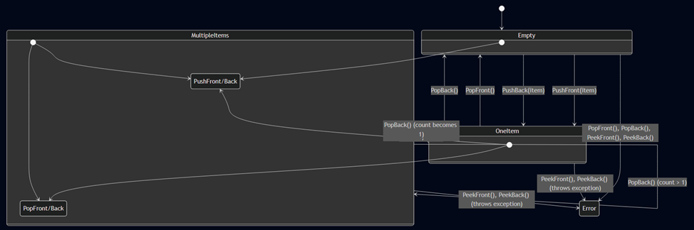
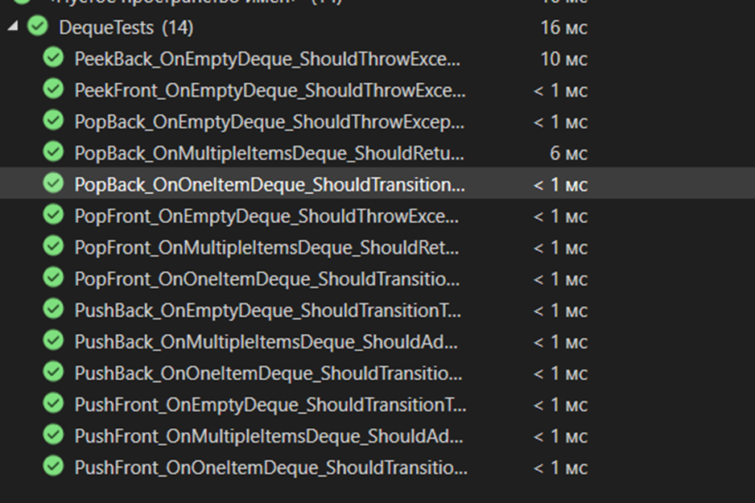

# Министерство науки и высшего образования Российской Федерации  
**Федеральное государственное бюджетное образовательное учреждение высшего образования**  
**«КУБАНСКИЙ ГОСУДАРСТВЕННЫЙ ТЕХНОЛОГИЧЕСКИЙ УНИВЕРСИТЕТ»**  
(ФГБОУ ВО «КубГТУ»)  

**Институт компьютерных систем и информационной безопасности**  
**Кафедра информационных систем и программирования**

---

## ЛАБОРАТОРНАЯ РАБОТА № 7

**Дисциплина:** Тестирование и отладка программного обеспечения  
**Работу выполнил:** А.А. Фролов  
**Направление подготовки:** 09.03.04 Программная инженерия  
**Преподаватель:** А. Г. Волик  


Краснодар  
2025

---


**Тема:** Модульное тестирование объектно-ориентированных программ

**Цель работы:** изучить подход к автоматизации процесса модульного тестирования объектно-ориентированных программ.

## Задание

1.  Создать класс (дек; односвязный список), реализующий работу с АСД (абстрактная структура данных).
2.  Построить диаграмму состояний класса.
3.  Составить тестовые требования к методам класса на основе полученной диаграммы состояний.
4.  Определить наборы тестов на основе полученных тестовых требований.
5.  Создать проект для автоматизированного модульного тестирования на основе тестовых наборов.
6.  Запустить тестирование и проверить результаты работы.
7.  Составить отчет о результатах проведенного тестирования.

## Ход работы

### Реализация класса дека

```csharp
using System;
using System.Collections;
using System.Collections.Generic;

/// <summary>
/// Дек (двусторонняя очередь), реализованный на основе односвязного списка.
/// Внимание: операции PushBack и PopBack имеют сложность O(n) из-за необходимости
/// обхода всего списка для доступа к предпоследнему элементу.
/// </summary>
/// <typeparam name="T">Тип элементов, хранящихся в деке.</typeparam>
public class Deque<T> : IEnumerable<T>
{
    // Внутренний класс для представления узла односвязного списка
    private class Node
    {
        public T Data { get; set; }
        public Node Next { get; set; }

        public Node(T data)
        {
            Data = data;
            Next = null;
        }
    }

    private Node _head; // Голова списка (начало дека)
    private Node _tail; // Хвост списка (конец дека)
    private int _count;

    public int Count => _count;
    public bool IsEmpty => _count == 0;

    /// <summary>
    /// Добавляет элемент в начало дека.
    /// </summary>
    public void PushFront(T item)
    {
        Node newNode = new Node(item);
        newNode.Next = _head;
        _head = newNode;

        if (_tail == null) // Если дек был пуст
        {
            _tail = _head;
        }
        _count++;
    }

    /// <summary>
    /// Добавляет элемент в конец дека.
    /// Сложность: O(n) из-за обхода списка.
    /// </summary>
    public void PushBack(T item)
    {
        Node newNode = new Node(item);

        if (_head == null) // Если дек пуст
        {
            _head = newNode;
            _tail = newNode;
        }
        else
        {
            // В односвязном списке для добавления в конец нужно найти предпоследний узел
            Node current = _head;
            while (current.Next != null)
            {
                current = current.Next;
            }
            current.Next = newNode;
            _tail = newNode;
        }
        _count++;
    }

    /// <summary>
    /// Удаляет и возвращает элемент из начала дека.
    /// </summary>
    public T PopFront()
    {
        if (IsEmpty)
            throw new InvalidOperationException("Дек пуст.");

        T item = _head.Data;
        _head = _head.Next;
        _count--;

        if (_head == null) // Если дек стал пустым
        {
            _tail = null;
        }
        return item;
    }

    /// <summary>
    /// Удаляет и возвращает элемент из конца дека.
    /// Сложность: O(n) из-за обхода списка.
    /// </summary>
    public T PopBack()
    {
        if (IsEmpty)
            throw new InvalidOperationException("Дек пуст.");

        if (_head.Next == null) // Если в деке один элемент
        {
            T item = _head.Data;
            _head = null;
            _tail = null;
            _count = 0;
            return item;
        }

        // Находим предпоследний узел
        Node current = _head;
        while (current.Next.Next != null)
        {
            current = current.Next;
        }

        T itemToReturn = current.Next.Data;
        current.Next = null;
        _tail = current;
        _count--;
        return itemToReturn;
    }

    /// <summary>
    /// Возвращает элемент из начала дека без его удаления.
    /// </summary>
    public T PeekFront()
    {
        if (IsEmpty)
            throw new InvalidOperationException("Дек пуст.");
        return _head.Data;
    }

    /// <summary>
    /// Возвращает элемент из конца дека без его удаления.
    /// </summary>
    public T PeekBack()
    {
        if (IsEmpty)
            throw new InvalidOperationException("Дек пуст.");
        return _tail.Data;
    }

    public IEnumerator<T> GetEnumerator()
    {
        Node current = _head;
        while (current != null)
        {
            yield return current.Data;
            current = current.Next;
        }
    }

    IEnumerator IEnumerable.GetEnumerator()
    {
        return GetEnumerator();
    }
}
```

### Диаграмма состояний класса



### Тестовые требования к методам класса

**Состояние: Empty**
1.  **TR-E1:** Вызов `PushFront(item)` должен перевести дек в состояние `OneItem`. `Count` должен стать 1. `PeekFront` и `PeekBack` должны вернуть `item`.
2.  **TR-E2:** Вызов `PushBack(item)` должен перевести дек в состояние `OneItem`. `Count` должен стать 1. `PeekFront` и `PeekBack` должны вернуть `item`.
3.  **TR-E3:** Вызов `PopFront()` должен выбросить `InvalidOperationException`.
4.  **TR-E4:** Вызов `PopBack()` должен выбросить `InvalidOperationException`.
5.  **TR-E5:** Вызов `PeekFront()` должен выбросить `InvalidOperationException`.
6.  **TR-E6:** Вызов `PeekBack()` должен выбросить `InvalidOperationException`.

**Состояние: OneItem**
7.  **TR-O1:** Вызов `PushFront(newItem)` должен перевести дек в состояние `MultipleItems`. `Count` должен стать 2. `PeekFront` должен вернуть `newItem`, `PeekBack` должен вернуть старый элемент.
8.  **TR-O2:** Вызов `PushBack(newItem)` должен перевести дек в состояние `MultipleItems`. `Count` должен стать 2. `PeekFront` должен вернуть старый элемент, `PeekBack` должен вернуть `newItem`.
9.  **TR-O3:** Вызов `PopFront()` должен перевести дек в состояние `Empty`, вернуть единственный элемент. `Count` должен стать 0.
10. **TR-O4:** Вызов `PopBack()` должен перевести дек в состояние `Empty`, вернуть единственный элемент. `Count` должен стать 0.
11. **TR-O5:** Вызов `PeekFront()` должен вернуть единственный элемент, не меняя состояние.
12. **TR-O6:** Вызов `PeekBack()` должен вернуть единственный элемент, не меняя состояние.

**Состояние: MultipleItems**
13. **TR-M1:** Вызов `PushFront(newItem)` должен оставить дек в состоянии `MultipleItems`. `Count` должен увеличиться на 1. `PeekFront` должен вернуть `newItem`.
14. **TR-M2:** Вызов `PushBack(newItem)` должен оставить дек в состоянии `MultipleItems`. `Count` должен увеличиться на 1. `PeekBack` должен вернуть `newItem`.
15. **TR-M3:** Вызов `PopFront()` должен оставить дек в состоянии `MultipleItems` (если было >2 элементов) или перевести в `OneItem` (если было 2). Он должен вернуть корректный элемент.
16. **TR-M4:** Вызов `PopBack()` должен оставить дек в состоянии `MultipleItems` (если было >2 элементов) или перевести в `OneItem` (если было 2). Он должен вернуть корректный элемент.
17. **TR-M5:** Вызов `PeekFront()` должен вернуть первый элемент, не меняя состояние.
18. **TR-M6:** Вызов `PeekBack()` должен вернуть последний элемент, не меняя состояние.

### Модульное тестирование на основе требований

```csharp
using NUnit.Framework;
using System;

[TestFixture]
public class DequeTests
{
    private Deque<int> _deque;

    [SetUp]
    public void Setup()
    {
        _deque = new Deque<int>();
    }

    // --- Тесты для состояния Empty (Требования TR-E1 ... TR-E6) ---
    [Test]
    public void PushFront_OnEmptyDeque_ShouldTransitionToOneItemState()
    {
        _deque.PushFront(10);
        Assert.AreEqual(1, _deque.Count, "Count should be 1");
        Assert.AreEqual(10, _deque.PeekFront(), "Front item should be 10");
        Assert.AreEqual(10, _deque.PeekBack(), "Back item should be 10");
    }

    [Test]
    public void PushBack_OnEmptyDeque_ShouldTransitionToOneItemState()
    {
        _deque.PushBack(20);
        Assert.AreEqual(1, _deque.Count, "Count should be 1");
        Assert.AreEqual(20, _deque.PeekFront(), "Front item should be 20");
        Assert.AreEqual(20, _deque.PeekBack(), "Back item should be 20");
    }

    [Test]
    public void PopFront_OnEmptyDeque_ShouldThrowException() =>
        Assert.Throws<InvalidOperationException>(() => _deque.PopFront());

    [Test]
    public void PopBack_OnEmptyDeque_ShouldThrowException() =>
        Assert.Throws<InvalidOperationException>(() => _deque.PopBack());

    [Test]
    public void PeekFront_OnEmptyDeque_ShouldThrowException() =>
        Assert.Throws<InvalidOperationException>(() => _deque.PeekFront());

    [Test]
    public void PeekBack_OnEmptyDeque_ShouldThrowException() =>
        Assert.Throws<InvalidOperationException>(() => _deque.PeekBack());

    // --- Тесты для состояния OneItem (Требования TR-O1 ... TR-O6) ---
    [Test]
    public void PushFront_OnOneItemDeque_ShouldTransitionToMultipleItemsState()
    {
        _deque.PushBack(10); // Устанавливаем состояние OneItem
        _deque.PushFront(20);

        Assert.AreEqual(2, _deque.Count, "Count should be 2");
        Assert.AreEqual(20, _deque.PeekFront(), "Front item should be 20");
        Assert.AreEqual(10, _deque.PeekBack(), "Back item should be 10");
    }

    [Test]
    public void PushBack_OnOneItemDeque_ShouldTransitionToMultipleItemsState()
    {
        _deque.PushFront(10); // Устанавливаем состояние OneItem
        _deque.PushBack(20);

        Assert.AreEqual(2, _deque.Count, "Count should be 2");
        Assert.AreEqual(10, _deque.PeekFront(), "Front item should be 10");
        Assert.AreEqual(20, _deque.PeekBack(), "Back item should be 20");
    }

    [Test]
    public void PopFront_OnOneItemDeque_ShouldTransitionToEmptyState()
    {
        _deque.PushBack(10); // Устанавливаем состояние OneItem
        int item = _deque.PopFront();

        Assert.AreEqual(10, item, "Returned item should be 10");
        Assert.AreEqual(0, _deque.Count, "Count should be 0");
        Assert.IsTrue(_deque.IsEmpty, "Deque should be empty");
    }

    [Test]
    public void PopBack_OnOneItemDeque_ShouldTransitionToEmptyState()
    {
        _deque.PushBack(10); // Устанавливаем состояние OneItem
        int item = _deque.PopBack();

        Assert.AreEqual(10, item, "Returned item should be 10");
        Assert.AreEqual(0, _deque.Count, "Count should be 0");
        Assert.IsTrue(_deque.IsEmpty, "Deque should be empty");
    }

    // --- Тесты для состояния MultipleItems (Требования TR-M1 ... TR-M6) ---
    [Test]
    public void PushFront_OnMultipleItemsDeque_ShouldAddToFront()
    {
        // Устанавливаем состояние MultipleItems
        _deque.PushBack(10);
        _deque.PushBack(20);

        _deque.PushFront(5);

        Assert.AreEqual(3, _deque.Count, "Count should be 3");
        Assert.AreEqual(5, _deque.PeekFront(), "Front item should be 5");
        Assert.AreEqual(20, _deque.PeekBack(), "Back item should be 20");
    }

    [Test]
    public void PushBack_OnMultipleItemsDeque_ShouldAddToBack()
    {
        // Устанавливаем состояние MultipleItems
        _deque.PushFront(10);
        _deque.PushFront(20);

        _deque.PushBack(25);

        Assert.AreEqual(3, _deque.Count, "Count should be 3");
        Assert.AreEqual(20, _deque.PeekFront(), "Front item should be 20");
        Assert.AreEqual(25, _deque.PeekBack(), "Back item should be 25");
    }

    [Test]
    public void PopFront_OnMultipleItemsDeque_ShouldReturnCorrectItem()
    {
        // Устанавливаем состояние MultipleItems
        _deque.PushBack(10);
        _deque.PushBack(20);
        _deque.PushBack(30);

        int item = _deque.PopFront();

        Assert.AreEqual(10, item, "Returned item should be 10");
        Assert.AreEqual(2, _deque.Count, "Count should be 2");
        Assert.AreEqual(20, _deque.PeekFront(), "New front item should be 20");
    }

    [Test]
    public void PopBack_OnMultipleItemsDeque_ShouldReturnCorrectItem()
    {
        // Устанавливаем состояние MultipleItems
        _deque.PushBack(10);
        _deque.PushBack(20);
        _deque.PushBack(30);

        int item = _deque.PopBack();

        Assert.AreEqual(30, item, "Returned item should be 30");
        Assert.AreEqual(2, _deque.Count, "Count should be 2");
        Assert.AreEqual(20, _deque.PeekBack(), "New back item should be 20");
    }
}
```

### Результаты тестирования



## Вывод

В ходе выполнения лабораторной работы был изучен подход к автоматизации процесса модульного тестирования объектно-ориентированных программ.