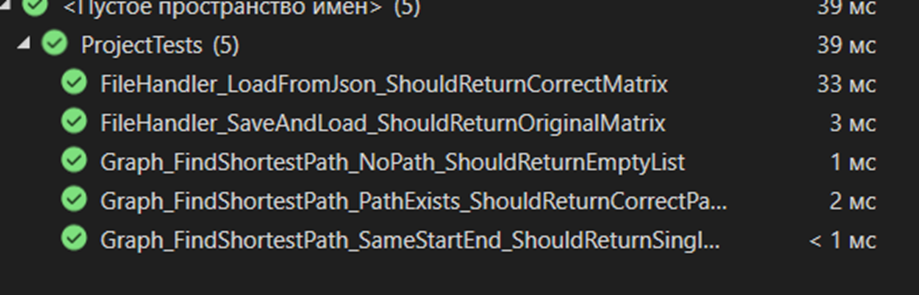

# Министерство науки и высшего образования Российской Федерации  
**Федеральное государственное бюджетное образовательное учреждение высшего образования**  
**«КУБАНСКИЙ ГОСУДАРСТВЕННЫЙ ТЕХНОЛОГИЧЕСКИЙ УНИВЕРСИТЕТ»**  
(ФГБОУ ВО «КубГТУ»)  

**Институт компьютерных систем и информационной безопасности**  
**Кафедра информационных систем и программирования**

---

## ЛАБОРАТОРНАЯ РАБОТА № 8

**Дисциплина:** Тестирование и отладка программного обеспечения  
**Работу выполнил:** А.А. Фролов  
**Направление подготовки:** 09.03.04 Программная инженерия  
**Преподаватель:** А. Г. Волик  


Краснодар  
2025

---


## Цель работы

Изучить подход к автоматизации процесса тестирования с использованием тестовых двойников (Test Doubles).

## Задание

1. Создать класс, реализующий граф, хранящий информацию о структуре графа на основе списка связности
2. В созданном классе реализовать нахождение кратчайшего пути
3. В качестве источника данных использовать класс, реализующий чтение из файла JSON формата и возвращающего данные в виде матрицы смежности
4. Реализовать возможность сохранения данных в файл формата json, с помощью отдельного класса, в формате матрицы смежности
5. Для обработки файла создать отдельный класс/классы, реализующий методы загрузки из файла (возвращающий считанные данных в определенном формате) и сохранения в файл (сохраняющий матрицу в определенном формате, который может отличаться от внутреннего представления графа).
6. Протестировать класс для работы с заданным форматом файлов (при тестировании класса использовать подмену класса на StringReader /StringWriter для доступа к строковому потоку с последующей проверкой полученной выходной строки).
7. Протестировать класс, реализующий непосредственные вычисления (при получении данных и сохранения использовать заглушки и фиктивные объекты)

## Решение

### Код класса графа

```csharp
using System;
using System.Collections.Generic;
using System.Linq;

public class Graph
{
    // Внутреннее представление графа - список связности
    private readonly Dictionary<int, List<int>> _adjacencyList;
    public int VertexCount => _adjacencyList.Count;

    /// <summary>
    /// Создает граф из матрицы смежности.
    /// </summary>
    /// <param name="adjacencyMatrix">Матрица смежности, где 0 - нет ребра, 1 - есть ребро.</param>
    public Graph(int[,] adjacencyMatrix)
    {
        _adjacencyList = new Dictionary<int, List<int>>();
        int n = adjacencyMatrix.GetLength(0);

        for (int i = 0; i < n; i++)
        {
            _adjacencyList[i] = new List<int>();
            for (int j = 0; j < n; j++)
            {
                if (adjacencyMatrix[i, j] > 0)
                {
                    _adjacencyList[i].Add(j);
                }
            }
        }
    }

    /// <summary>
    /// Находит кратчайший путь между двумя вершинами с помощью поиска в ширину (BFS).
    /// </summary>
    /// <param name="startVertex">Начальная вершина.</param>
    /// <param name="endVertex">Конечная вершина.</param>
    /// <returns>Список вершин, представляющий кратчайший путь. Если путь не найден, возвращает пустой список.</returns>
    public List<int> FindShortestPath(int startVertex, int endVertex)
    {
        if (!_adjacencyList.ContainsKey(startVertex) || !_adjacencyList.ContainsKey(endVertex))
        {
            return new List<int>(); // Возвращаем пустой путь, если вершины не существуют
        }

        var queue = new Queue<int>();
        var visited = new HashSet<int>();
        var parent = new Dictionary<int, int>();

        queue.Enqueue(startVertex);
        visited.Add(startVertex);

        while (queue.Count > 0)
        {
            int currentVertex = queue.Dequeue();

            if (currentVertex == endVertex)
            {
                // Восстанавливаем путь
                var path = new List<int>();
                int step = endVertex;
                while (parent.ContainsKey(step))
                {
                    path.Add(step);
                    step = parent[step];
                }
                path.Add(startVertex);
                path.Reverse();
                return path;
            }

            foreach (var neighbor in _adjacencyList[currentVertex])
            {
                if (!visited.Contains(neighbor))
                {
                    visited.Add(neighbor);
                    parent[neighbor] = currentVertex;
                    queue.Enqueue(neighbor);
                }
            }
        }

        return new List<int>(); // Путь не найден
    }

    /// <summary>
    /// Преобразует граф обратно в матрицу смежности для сохранения.
    /// </summary>
    public int[,] ToAdjacencyMatrix()
    {
        int n = _adjacencyList.Count;
        var matrix = new int[n, n];
        for (int i = 0; i < n; i++)
        {
            foreach (var neighbor in _adjacencyList[i])
            {
                matrix[i, neighbor] = 1;
            }
        }
        return matrix;
    }
}
```

### Код FileHandler

```csharp
using System;
using System.Collections.Generic;
using System.IO;

public class FileHandler
{
    /// <summary>
    /// Загружает матрицу смежности из JSON-потока.
    /// </summary>
    /// <param name="reader">Текстовый поток (например, StreamReader или StringReader).</param>
    /// <returns>Матрица смежности в виде двумерного массива.</returns>
    public int[,] LoadFromJson(TextReader reader)
    {
        string json = reader.ReadToEnd();
        // Десериализуем в список списков, т.к. int[,] не поддерживается
        var jaggedArray = System.Text.Json.JsonSerializer.Deserialize<List<List<int>>>(json);

        if (jaggedArray == null || jaggedArray.Count == 0)
        {
            return new int[0, 0];
        }

        int rows = jaggedArray.Count;
        int cols = jaggedArray[0].Count;

        // Проверяем, что матрица прямоугольная (все строки одинаковой длины)
        foreach (var row in jaggedArray)
        {
            if (row.Count != cols)
            {
                throw new FormatException("JSON не представляет собой корректную прямоугольную матрицу.");
            }
        }

        // Преобразуем список списков обратно в двумерный массив
        var matrix = new int[rows, cols];
        for (int i = 0; i < rows; i++)
        {
            for (int j = 0; j < cols; j++)
            {
                matrix[i, j] = jaggedArray[i][j];
            }
        }

        return matrix;
    }

    /// <summary>
    /// Сохраняет матрицу смежности в JSON-поток.
    /// </summary>
    /// <param name="writer">Текстовый поток (например, StreamWriter или StringWriter).</param>
    /// <param name="matrix">Матрица смежности для сохранения.</param>
    public void SaveToJson(TextWriter writer, int[,] matrix)
    {
        int rows = matrix.GetLength(0);
        int cols = matrix.GetLength(1);
        var jaggedArray = new List<List<int>>(rows);

        // Преобразуем двумерный массив в список списков для сериализации
        for (int i = 0; i < rows; i++)
        {
            var row = new List<int>(cols);
            for (int j = 0; j < cols; j++)
            {
                row.Add(matrix[i, j]);
            }
            jaggedArray.Add(row);
        }

        var options = new System.Text.Json.JsonSerializerOptions { WriteIndented = true };
        // Сериализуем список списков
        string json = System.Text.Json.JsonSerializer.Serialize(jaggedArray, options);
        writer.Write(json);
    }
}
```

### Код тестов

```csharp
using NUnit.Framework;
using System;
using System.IO;
using System.Linq;

[TestFixture]
public class ProjectTests
{
    private FileHandler _fileHandler;

    [SetUp]
    public void Setup()
    {
        _fileHandler = new FileHandler();
    }

    // --- Тестирование FileHandler ---

    [Test]
    public void FileHandler_LoadFromJson_ShouldReturnCorrectMatrix()
    {
        // Arrange: создаем строку с JSON и оборачиваем ее в StringReader
        // JsonSerializer.Deserialize может читать как компактный, так и форматированный JSON
        string jsonString = "[[0,1],[1,0]]";
        using var reader = new StringReader(jsonString);

        // Act: загружаем данные из строкового потока
        int[,] matrix = _fileHandler.LoadFromJson(reader);

        // Assert: проверяем результат
        Assert.AreEqual(2, matrix.GetLength(0));
        Assert.AreEqual(0, matrix[0, 0]);
        Assert.AreEqual(1, matrix[0, 1]);
        Assert.AreEqual(1, matrix[1, 0]);
        Assert.AreEqual(0, matrix[1, 1]);
    }

    /// <summary>
    /// Вспомогательный метод для сравнения двух матриц.
    /// </summary>
    private bool AreMatricesEqual(int[,] m1, int[,] m2)
    {
        if (m1.GetLength(0) != m2.GetLength(0) || m1.GetLength(1) != m2.GetLength(1))
            return false;

        for (int i = 0; i < m1.GetLength(0); i++)
        {
            for (int j = 0; j < m1.GetLength(1); j++)
            {
                if (m1[i, j] != m2[i, j])
                    return false;
            }
        }
        return true;
    }

    [Test]
    public void FileHandler_SaveAndLoad_ShouldReturnOriginalMatrix()
    {
        // Arrange: создаем исходную матрицу
        var originalMatrix = new int[,] { { 0, 1, 0 }, { 1, 0, 1 }, { 0, 1, 0 } };
        int[,] loadedMatrix;

        // Act: сохраняем матрицу в строку, а затем загружаем ее из этой же строки
        using (var writer = new StringWriter())
        {
            _fileHandler.SaveToJson(writer, originalMatrix);
            string json = writer.ToString();

            using (var reader = new StringReader(json))
            {
                loadedMatrix = _fileHandler.LoadFromJson(reader);
            }
        }

        // Assert: сравниваем исходную и загруженную матрицы
        Assert.IsTrue(AreMatricesEqual(originalMatrix, loadedMatrix), "Матрицы должны быть идентичны после сохранения и загрузки.");
    }

    // --- Тестирование класса Graph с использованием заглушек (фиктивных данных) ---
    [Test]
    public void Graph_FindShortestPath_PathExists_ShouldReturnCorrectPath()
    {
        // Arrange: создаем "заглушку" - матрицу, описывающую граф
        var matrix = new int[,]
        {
            { 0, 1, 1, 0 }, // 0 -> 1, 2
            { 1, 0, 0, 1 }, // 1 -> 0, 3
            { 1, 0, 0, 1 }, // 2 -> 0, 3
            { 0, 1, 1, 0 }  // 3 -> 1, 2
        };
        var graph = new Graph(matrix);

        // Act
        var path = graph.FindShortestPath(0, 3);

        // Assert: Проверяем свойства пути, а не его точную последовательность
        Assert.IsNotEmpty(path, "Path should not be empty");
        Assert.AreEqual(0, path.First(), "Path should start at vertex 0");
        Assert.AreEqual(3, path.Last(), "Path should end at vertex 3");
        Assert.AreEqual(3, path.Count, "Path length should be 3");

        // Проверяем, что каждый шаг в пути является валидным ребром в графе
        for (int i = 0; i < path.Count - 1; i++)
        {
            Assert.IsTrue(matrix[path[i], path[i + 1]] > 0, $"Edge from {path[i]} to {path[i + 1]} does not exist");
        }
    }

    [Test]
    public void Graph_FindShortestPath_NoPath_ShouldReturnEmptyList()
    {
        // Arrange: граф, где нет пути между вершинами
        var matrix = new int[,]
        {
            { 0, 1, 0 },
            { 1, 0, 0 },
            { 0, 0, 0 }
        };
        var graph = new Graph(matrix);

        // Act
        var path = graph.FindShortestPath(0, 2);

        // Assert
        Assert.IsEmpty(path);
    }

    [Test]
    public void Graph_FindShortestPath_SameStartEnd_ShouldReturnSingleVertex()
    {
        // Arrange
        var matrix = new int[,] { { 0 } };
        var graph = new Graph(matrix);

        // Act
        var path = graph.FindShortestPath(0, 0);

        // Assert
        Assert.AreEqual(1, path.Count);
        Assert.AreEqual(0, path[0]);
    }
}
```

## Результаты тестирования

*Здесь могла бы быть ссылка на изображение с результатами тестирования: *
