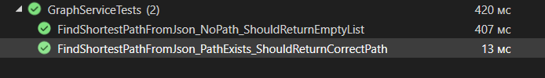

# Министерство науки и высшего образования Российской Федерации  
**Федеральное государственное бюджетное образовательное учреждение высшего образования**  
**«КУБАНСКИЙ ГОСУДАРСТВЕННЫЙ ТЕХНОЛОГИЧЕСКИЙ УНИВЕРСИТЕТ»**  
(ФГБОУ ВО «КубГТУ»)  

**Институт компьютерных систем и информационной безопасности**  
**Кафедра информационных систем и программирования**

---

## ЛАБОРАТОРНАЯ РАБОТА № 9

**Дисциплина:** Тестирование и отладка программного обеспечения  
**Работу выполнил:** А.А. Фролов  
**Направление подготовки:** 09.03.04 Программная инженерия  
**Преподаватель:** А. Г. Волик  


Краснодар  
2025

---

## Цель работы

Изучить подход к автоматизации создания тестовых двойников (test doubles) при помощи библиотеки NSubstitute.

## Задание

1.  На основе класса графа создать тестирующий проект, создающий тестовых двойников при помощи NSubstitute.
2.  Протестировать класс.

## Решение

### Код класса графа

```csharp
using System;
using System.Collections.Generic;
using System.Linq;

public class Graph
{
    // Внутреннее представление графа - список связности
    private readonly Dictionary<int, List<int>> _adjacencyList;
    public int VertexCount => _adjacencyList.Count;

    /// <summary>
    /// Создает граф из матрицы смежности.
    /// </summary>
    /// <param name="adjacencyMatrix">Матрица смежности, где 0 - нет ребра, 1 - есть ребро.</param>
    public Graph(int[,] adjacencyMatrix)
    {
        _adjacencyList = new Dictionary<int, List<int>>();
        int n = adjacencyMatrix.GetLength(0);

        for (int i = 0; i < n; i++)
        {
            _adjacencyList[i] = new List<int>();
            for (int j = 0; j < n; j++)
            {
                if (adjacencyMatrix[i, j] > 0)
                {
                    _adjacencyList[i].Add(j);
                }
            }
        }
    }

    /// <summary>
    /// Находит кратчайший путь между двумя вершинами с помощью поиска в ширину (BFS).
    /// </summary>
    /// <param name="startVertex">Начальная вершина.</param>
    /// <param name="endVertex">Конечная вершина.</param>
    /// <returns>Список вершин, представляющий кратчайший путь. Если путь не найден, возвращает пустой список.</returns>
    public List<int> FindShortestPath(int startVertex, int endVertex)
    {
        if (!_adjacencyList.ContainsKey(startVertex) || !_adjacencyList.ContainsKey(endVertex))
        {
            return new List<int>(); // Возвращаем пустой путь, если вершины не существуют
        }

        var queue = new Queue<int>();
        var visited = new HashSet<int>();
        var parent = new Dictionary<int, int>();

        queue.Enqueue(startVertex);
        visited.Add(startVertex);

        while (queue.Count > 0)
        {
            int currentVertex = queue.Dequeue();

            if (currentVertex == endVertex)
            {
                // Восстанавливаем путь
                var path = new List<int>();
                int step = endVertex;
                while (parent.ContainsKey(step))
                {
                    path.Add(step);
                    step = parent[step];
                }
                path.Add(startVertex);
                path.Reverse();
                return path;
            }

            foreach (var neighbor in _adjacencyList[currentVertex])
            {
                if (!visited.Contains(neighbor))
                {
                    visited.Add(neighbor);
                    parent[neighbor] = currentVertex;
                    queue.Enqueue(neighbor);
                }
            }
        }

        return new List<int>(); // Путь не найден
    }

    /// <summary>
    /// Преобразует граф обратно в матрицу смежности для сохранения.
    /// </summary>
    public int[,] ToAdjacencyMatrix()
    {
        int n = _adjacencyList.Count;
        var matrix = new int[n, n];
        for (int i = 0; i < n; i++)
        {
            foreach (var neighbor in _adjacencyList[i])
            {
                matrix[i, neighbor] = 1;
            }
        }
        return matrix;
    }
}
```

### Код тестов

```csharp
using NUnit.Framework;
using NSubstitute; // <-- Важно: подключить NSubstitute
using System;
using System.Collections.Generic;
using System.IO;

[TestFixture]
public class GraphServiceTests
{
    private GraphService _graphService;
    private IFileHandler _fileHandlerSubstitute; // Наш "двойник"

    [SetUp]
    public void Setup()
    {
        // 1. Создаем тестового двойника (mock) для интерфейса IFileHandler
        _fileHandlerSubstitute = Substitute.For<IFileHandler>();

        // 2. Создаем наш сервис, передавая ему двойник вместо реального объекта
        _graphService = new GraphService(_fileHandlerSubstitute);
    }

    [Test]
    public void FindShortestPathFromJson_PathExists_ShouldReturnCorrectPath()
    {
        // Arrange (Подготовка)
        var stubMatrix = new int[,]
        {
            { 0, 1, 1, 0 },
            { 1, 0, 0, 1 },
            { 1, 0, 0, 1 },
            { 0, 1, 1, 0 }
        };
        string jsonInput = "any_json_string"; // Содержимое JSON неважно, мы его перехватим

        // 3. Настраиваем поведение двойника: когда его метод LoadFromJson вызовут с любым TextReader,
        // он должен вернуть нашу заранее подготовленную матрицу (stubMatrix).
        _fileHandlerSubstitute.LoadFromJson(Arg.Any<TextReader>()).Returns(stubMatrix);

        // Act (Действие)
        var path = _graphService.FindShortestPathFromJson(jsonInput, 0, 3);

        // Assert (Проверка)
        Assert.IsNotEmpty(path);
        Assert.AreEqual(0, path[0]);
        Assert.AreEqual(3, path[path.Count - 1]);

        // 4. Проверяем взаимодействие: убедимся, что метод LoadFromJson у нашего двойника
        // действительно был вызван ровно один раз.
        _fileHandlerSubstitute.Received(1).LoadFromJson(Arg.Any<TextReader>());
    }

    [Test]
    public void FindShortestPathFromJson_NoPath_ShouldReturnEmptyList()
    {
        // Arrange
        var stubMatrix = new int[,]
        {
            { 0, 1, 0 },
            { 1, 0, 0 },
            { 0, 0, 0 }
        };
        _fileHandlerSubstitute.LoadFromJson(Arg.Any<TextReader>()).Returns(stubMatrix);

        // Act
        var path = _graphService.FindShortestPathFromJson("any_json", 0, 2);

        // Assert
        Assert.IsEmpty(path);
        _fileHandlerSubstitute.Received(1).LoadFromJson(Arg.Any<TextReader>());
    }
}
```

## Результаты тестирования

*Здесь могла бы быть ссылка на изображение с результатами тестирования: *
